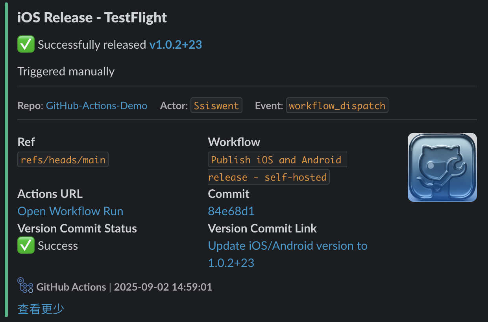
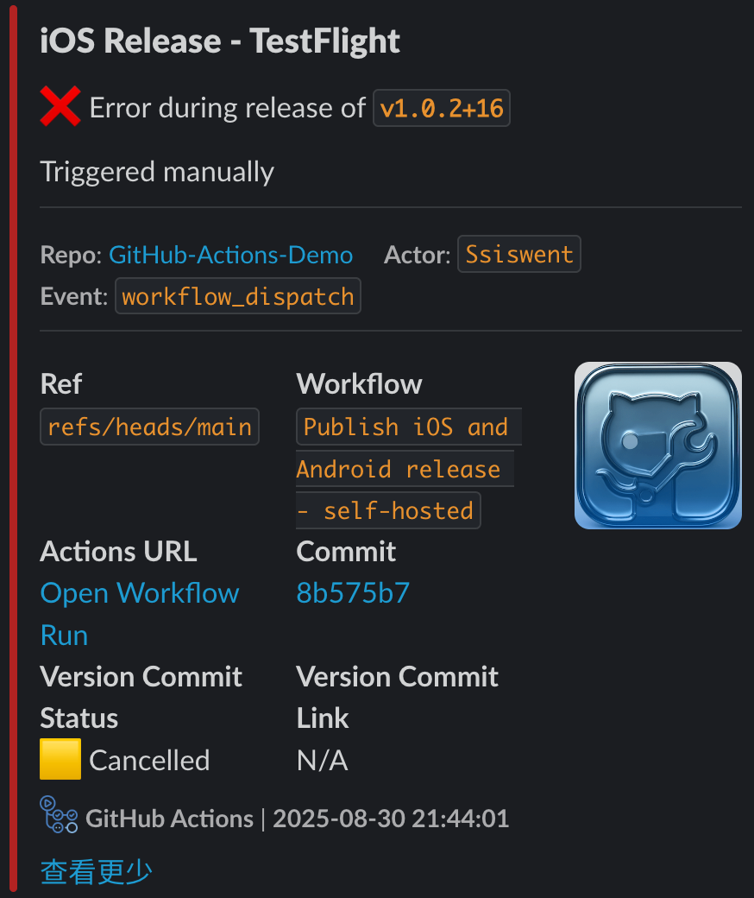

# Slack Github Action

Post a rich Slack Block Kit notification for GitHub Actions runs.

It standardizes success/failure formatting, links to your workflow run and commit, and shows release notes when triggered by a release event.

- Color mapping: success → #2FB886, failure → #B22222
- Emojis: ✅ for success, ❌ for failure
- Works with both GitHub-hosted and self-hosted runners

## Features

- Consistent Slack Block Kit layout across repositories and workflows
- Auto links to Workflow Run and Commit
- Short SHA badge, timestamp, repo/actor/event context
- Release-aware: shows tag and “Release notes” when `on: release`
- Simple boolean input `is_success` to drive color and status prefix
- Version commit summary: shows "Version Commit Status" (✅ Success / ❌ Failure / 🟨 Cancelled / ⏭️ Skipped) and a link when available

## Preview

<table style="width:100%;table-layout:fixed;border-collapse:collapse;">
  <thead>
    <tr>
      <th align="center">✅ Success</th>
      <th align="center">❌ Failure</th>
    </tr>
  </thead>
  <tbody>
    <tr>
      <td style="padding:6px;"></td>
      <td style="padding:6px;"></td>
    </tr>
    <tr>
      <td align="center"><sub>Example message for a successful run</sub></td>
      <td align="center"><sub>Example message for a failed run</sub></td>
    </tr>
  </tbody>
</table>

<p align="center">
  <sub>Colors: success → <code>#2FB886</code>, failure → <code>#B22222</code>. Includes header, context (repo • actor • event • time), links (workflow run, commit), and Version Commit Status.</sub>
  <br/>
  <sub>Rendered with Slack Block Kit; visuals may vary by workspace theme.</sub>
</p>

## Inputs

- webhook (required): Slack Incoming Webhook URL (pass from caller repository via secrets)
- is_success (required): 'true' or 'false' string to indicate success/failure
- header_text (required): Title text shown as Slack header
- version_number (required): Semantic version (e.g., 1.2.3) when not running on a release event
- build_number (required): Build number (e.g., 42) when not running on a release event
- app_icon_url (optional): Accessory image URL shown on the right in the fields section
- commit_result (optional): Final version commit result. One of `success | failure | cancelled | skipped`. Any other value falls back to `N/A`.
- commit_url (optional): URL of the version commit. Only shown when `commit_result == 'success'` and both `commit_url` and `commit_message` are present.
- commit_message (optional): Text used for the version commit link title.

Notes:
- GitHub Actions passes composite action inputs as strings. This action compares `is_success` to the literal string 'true'.
- When event is “release”, the tag (`github.ref_name`) is displayed and the second line shows “Release notes: …”.
- When not “release”, it displays `v<version_number>+<build_number>` and “Triggered manually”.
- The "Version Commit Status" line capitalizes labels: Success, Failure, Cancelled, Skipped; fallback is `N/A`.

## Usage

### Quick Start (Marketplace)

```yaml
name: Slack Notify (Demo)

on:
  workflow_dispatch:
    inputs:
      is_success:
        description: Whether the run is successful
        type: choice
        options: ["true", "false"]
        default: "true"
        required: true
      version_number:
        description: Version number (e.g., 1.2.3)
        default: "1.0.0"
        required: true
      build_number:
        description: Build number
        default: "1"
        required: true
      header_text:
        description: Header title
        default: Android Release - Play Store
        required: true
      app_icon_url:
        description: Optional icon URL
        required: false

jobs:
  notify:
    runs-on: ubuntu-latest
    steps:
      - name: Notify Slack
        uses: ssiswent/slack-github-action@v1
        with:
          webhook: ${{ secrets.SLACK_LOGS_WEBHOOK }}
          is_success: ${{ inputs.is_success }}          # or ${{ success() }}
          header_text: ${{ inputs.header_text }}
          version_number: ${{ inputs.version_number }}
          build_number: ${{ inputs.build_number }}
          app_icon_url: ${{ inputs.app_icon_url }}
          # Optional version commit details
          commit_result: 'skipped'
          commit_url: ''
          commit_message: ''
```

### Release Event Example (auto release notes)

```yaml
name: Notify on Release

on:
  release:
    types: [published]

jobs:
  notify:
    runs-on: ubuntu-latest
    steps:
      - name: Notify Slack
        uses: ssiswent/slack-github-action@v1
        with:
          webhook: ${{ secrets.SLACK_LOGS_WEBHOOK }}
          is_success: 'true'                          # or decide based on prior jobs
          header_text: 'Android Release - Play Store'
          version_number: '0.0.0'                     # ignored for release event
          build_number: '0'                           # ignored for release event
          # Optionally pass commit info if you have it
          commit_result: 'success'
          commit_url: 'https://github.com/owner/repo/commit/abc1234'
          commit_message: 'Update version to 1.2.3+45'
```

### Using a Build Job Result

```yaml
jobs:
  build:
    runs-on: ubuntu-latest
    steps:
      - run: echo "build something"

  notify:
    needs: [build]
    runs-on: ubuntu-latest
    steps:
      - name: Notify Slack with build result
        uses: ssiswent/slack-github-action@v1
        with:
          webhook: ${{ secrets.SLACK_LOGS_WEBHOOK }}
          is_success: ${{ needs.build.result == 'success' }}
          header_text: 'Android Release - Play Store'
          version_number: '1.0.0'
          build_number: '42'
          # If you have a downstream commit job, you can surface it here
          commit_result: ${{ needs.commit_version.result }}
          commit_url: ${{ needs.commit_version.outputs.commit_url }}
          commit_message: ${{ needs.commit_version.outputs.commit_message }}
```

## Security and Secrets

- This action cannot read caller repository secrets directly.
- Always pass the webhook from the caller workflow: `with.webhook: ${{ secrets.SLACK_LOGS_WEBHOOK }}`.

## Versioning

- Use floating major tags for stability and easy upgrades:
  - `@v1` → latest v1.x.y
- Semantic version tags available (e.g., `@v1.0.0`).

## Troubleshooting

- Missing “shell” in composite steps: Every step with `run:` must specify `shell: bash`.
- Webhook not set: Ensure your repo has `SLACK_LOGS_WEBHOOK` secret and you pass it to `with.webhook`.
- `is_success` truthiness: This action checks string `'true'` explicitly; pass `'true'` or `'false'` as strings or use expressions that resolve to those.
- Timezone: The timestamp uses “Asia/Shanghai”. Fork and adjust if needed.

## License

MIT
